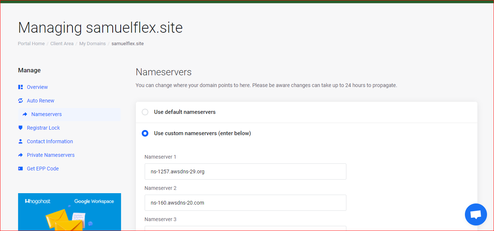
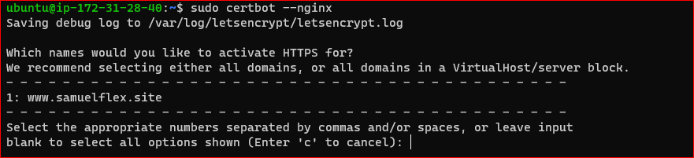

# CONFIGURE NGINX AS A LOAD BALANCER

in this project i Create Ubuntu Server 20.04 LTS EC2 VM and add TCP port 80 and TCP port 443

Install and configure nginx as load balancer to point traffic to resolvable DNS names of the webservers using `sudo apt install nginx` to install nginx, enable and check nginx status.

 I faced a lot of problem when I am creating doman name on whogohost.com which I was able to resolve with the help of the community channel and some videos. Then I create the domain name samuelflex.site which is not available now because I have termainated all my AWS instances. After creating the domain name I used the Load Balancer Server Public IP address in the domain manage section. I used public IP address instead of elastic IP address because someone told me that they charge per-hour for it and I realized that it will not charge me for it if I do connect it with instance and do not create more than one. 

I installed `certbot` with snap tool with `sudo snap install --classic`.

Then create the certificate by running `sudo certbot --nginx`.

Add the command `sudo certbot reset --dry-run` to run the comman periodically by adding `* */12 * * *   root /usr/bin/certbot renew > /dev/null 2>&1` to crontab.

Then I reload the website where I get a secure website on reloading

